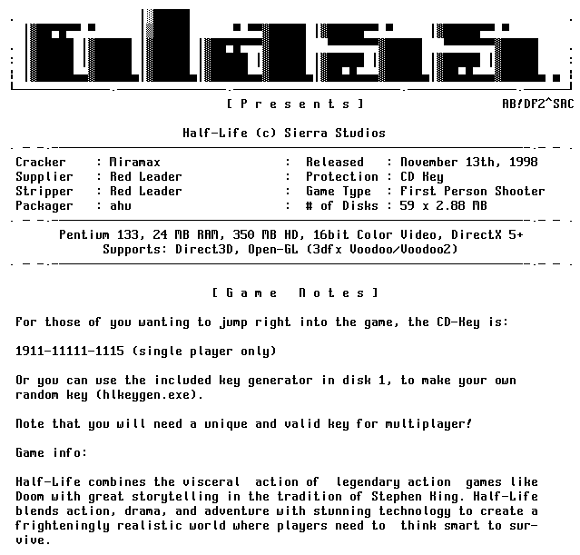

# Willy - Monospaced Font

A long time ago, my friend from the [demoscene](http://www.pouet.net/)
[Willy (aka Czarny Jobacz)](https://demozoo.org/sceners/3683/) - created a font that was perfect for
displaying [ascii art](https://en.wikipedia.org/wiki/ASCII_art).

http://www.roysac.com/roy-sac_styles_of_underground_text_art.html
https://demozoo.org/sceners/2068/

The problem is that this font was in the form of a bitmap and it has
been lying on my drive for several years, until recently, when I found
a small script written by the author of [Putty](https://www.putty.org/) - Simon Tatham,
to convert the data saved in the form of a text script into an
output .fon file (I'm attaching its source code in Python).

As a result, I present you a font called **Willy**, and it looks
like this:

I didn't want such an interesting material to be lost in the depths of the web,
so I decided to put it on GitHub.